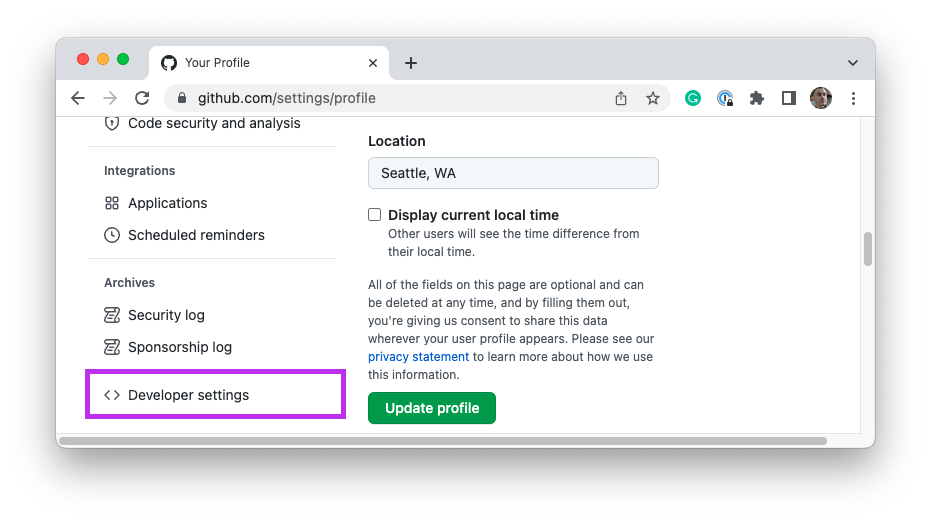

# Course Creation Tool

This internal tool is designed to be used by the Curriculum team. It achieves the following goals:

- When given a Canvas course ID, populates the course with Assignment Groups, Assignments, and Modules associated with a particular module.
- Matches all assignment links, readings, and activities to the appropriate GitHub organization.

## Installation

To install and run this repository, complete the following steps:

1. Clone this repository.
1. Create a new `.env` based on the `.env.template`. See the instructions below on how to complete the file.
1. Run `npm install`.
1. Run the commands detailed below, as needed.

### Access tokens

You will need two access tokens to use this tool: a `CANVAS_TOKEN` and a `GITHUB_AUTH_TOKEN`.

#### Canvas token

To create your `CANVAS_TOKEN`, login to Canvas and then click on **Account**. Then, click **Settings**.


Scroll down the next page until you see the **New Access Token** button. Click this button to create a new token. Copy the generated authentication code and insert it into your `.env` file next to the `CANVAS_TOKEN` entry. You should see the access token listed on Canvas as "User-Generated".


#### GitHub token

To create your `GITHUB_AUTH_TOKEN`, login to GitHub and then go to your **Settings** page. At the bottom of the navigation, you should see a link titled **Developer settings**. Click this.



Then, click the **Personal access tokens** link on the new page. Select **Tokens (classic)**. Create a new token with the **Generate new token** button. Copy the generated authentication code and insert it into your `.env` file next to the `GITHUB_AUTH_TOKEN` entry.


### Course-specific identifiers

In addition to access tokens, you will need some course-specific identifiers. This includes the `CANVAS_COURSE_ID`, `GITHUB_CLASSROOM_ORGANIZATION_PATH`, and `REPLIT_TEAM_PATH`. These can all be found relatively quickly by visiting the related websites.

To find the `CANVAS_COURSE_ID`, visit the course on Canvas. The string of numbers in the URL is the ID.


To find the `GITHUB_CLASSROOM_ORGANIZATION_PATH`, visit the organization that will be used _for the specific classroom_ on GitHub. The path at the end of the URL is the organization path.


To find the `REPLIT_TEAM_PATH`, visit the Replit Teams tab and click on the appropriate team. The path at the end of the URL is the team path.


## Instructions

To run the script, type the following command:

```
npm start canvas
```

This will open up the help menu for running the commands. You will need to provide additional arguments depending on the operation you are attempting to perform.

```
npm start canvas <resource> <unit> [number]
```

#### Options

You can add the `--verbose` flag to get more information on any errors that occur.

You can also set the config file path. To do so, prefix your command with `LOCAL_CONFIG_PATH=` and assign that environment variable a value that is the path to your config file.

### Assignments groups

To create assignment groups, all arguments will need to be provided. For example, the following command will create assignment groups for the Fundamentals unit, which is the 1st unit of the course.

```
npm start canvas groups fundamentals 1
```

### Assignments

To create assignments, the first three arguments will need to be provided. For example, the following command will create assignments for the Fundamentals unit.

```
npm start canvas assignments fundamentals
```

> **Note**: You must create assignment groups before creating assignments.

### Modules

To create modules and their associated links, the first three arguments will need to be provided. For example, the following command will create modules for the Fundamentals unit.

```
npm start canvas modules fundamentals
```

> **Note**: You must create assignments before creating modules.

### All

If you are confident that everything is set up correctly, you can run all three of the above actions in sequence. To do so, provide the `all` action and include both the unit name and number.

```
npm start canvas all fundamentals 1
```
